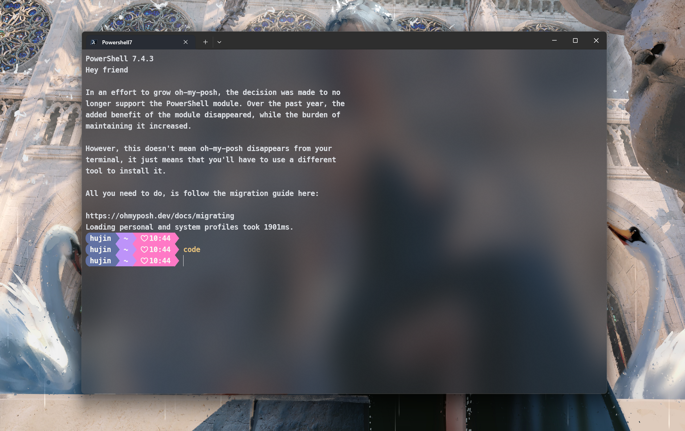
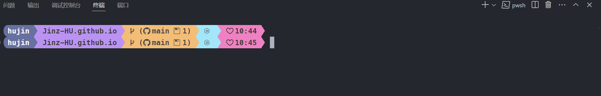
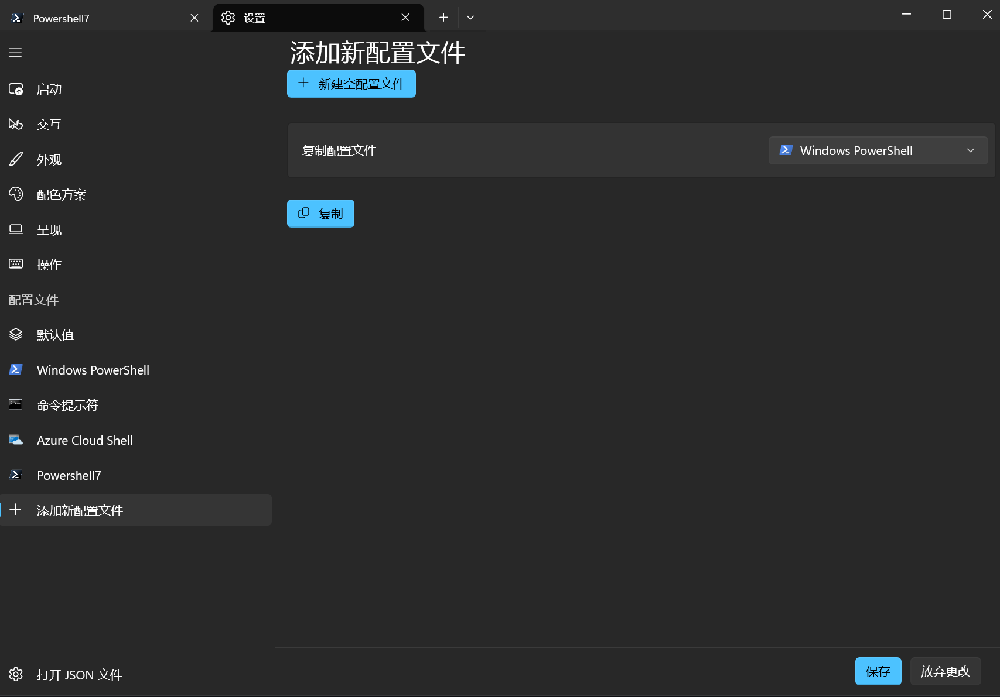
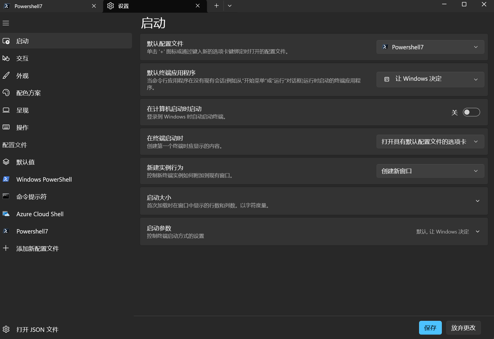
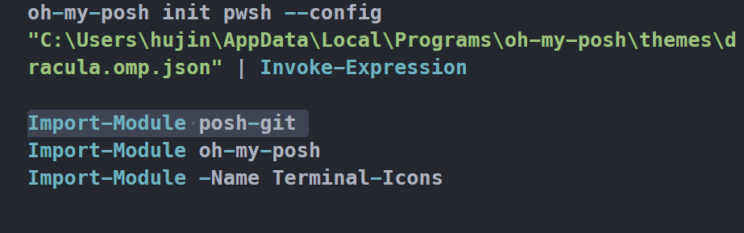
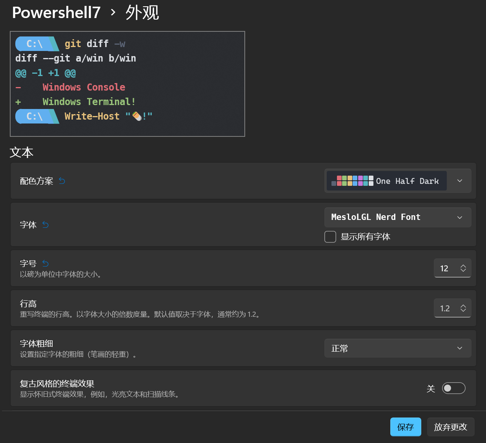
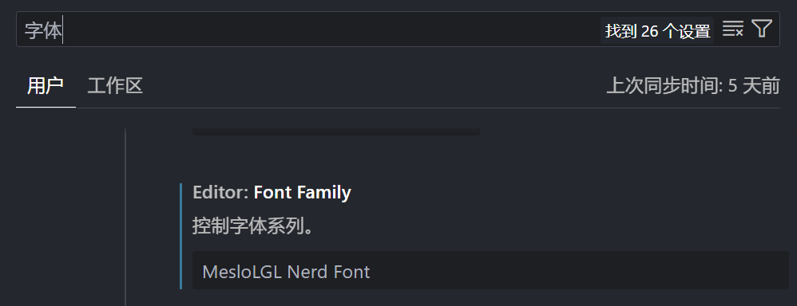
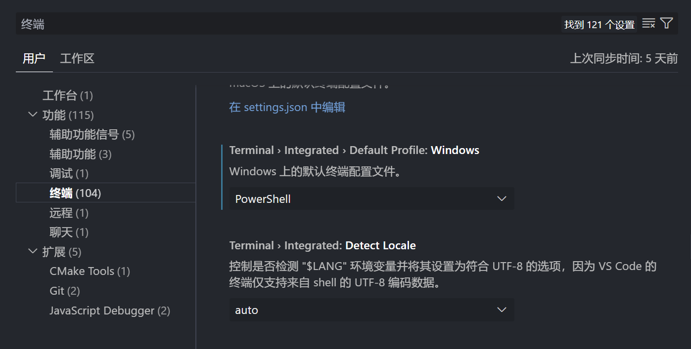

# VSCode——Optimize your terminal display

## windows 下的 VSCode 终端界面太丑，并且无法提供 git 相关信息

> 优化 windows 终端界面，改善 VScode 终端使用体验

**最终效果如下**



# Powershell

win11 自带了 `windows terminal`,不用自己再装，如果没有的话要自己装一下。

然后去下载[Powershell](https://github.com/PowerShell/PowerShell/releases),选择对应的版本

我选的是 win-x64.msi，和平常装其他软件的操作一样一直安装就行，这个有自带的补全和输入记忆。

安装完成之后打开终端，进入设置新建配置文件，点击复制



对应更改名称，命令行和图标，设置默认启动 PowerShell



# Oh-my-posh

## 安装 oh-my-posh

安装[Oh-my-posh](https://ohmyposh.dev/docs/installation/windows#install)，这个有点类似 zsh，看了一下效果也非常炫酷。

## 配置 oh-my-posh

新建终端输入

```dotnetcli
code $Profile
```

在配置文件中写入

```dotnetcli
oh-my-posh init pwsh --config "$env:POSH_THEMES_PATH/atomic.omp.json" | Invoke-Expression
```

输入`$Profile`使其生效

> 此处主题设置为 atmic，可以自行更改

在终端输入 `Get-PoshThemes` 可以查看所有主题，对应切换 `.omp.json` 即可生效

```dotnetcli
oh-my-posh init pwsh --config "$env:POSH_THEMES_PATH/dracula.omp.json" | Invoke-Expression
```

### 安装图标库

终端输入

```dotnetcli
Install-Module -Name Terminal-Icons -Repository PSGallery
```

在配置文件中加入 `Import-Module -Name Terminal-Icons`

### 显示终端 Git 状态

下载 posh-git

```dotnetcli
Install-Module posh-git
```

在配置文件中加入 `Import-Module posh-git`

最终的配置文件如下：



# 字体设置

Oh My Posh 中推荐的是[Nerd Fonts](https://ohmyposh.dev/docs/installation/fonts)字体，推荐使用 MesloLGL 字体，能够适配大部分图标，FiraCode 在展示图标时会出现乱码。

安装字体之后在终端配置字体



> 设置不透明度和亚克力材料可以达到类似玻璃的效果，但是有些命令不太好观察

# VSCode

设置字体 `Terminal › Integrated: Font Family` `Editor: Font Family`



默认终端设置为 PowerShell `Terminal › Integrated › Default Profile: Windows`

